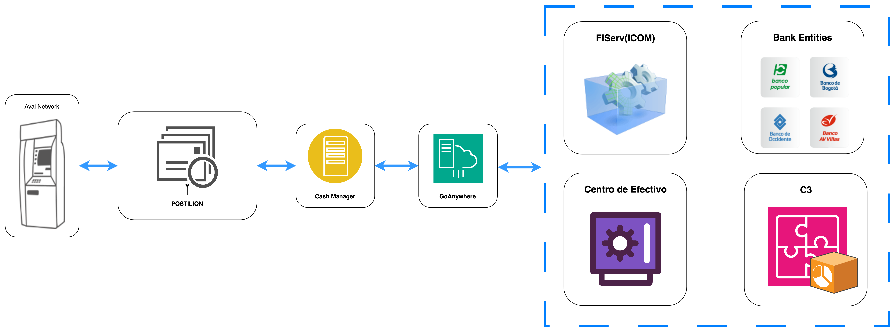

# Cash Manager Core

El módulo de procesamiento de mensajes de Cash Manager es una solución diseñada para optimizar la gestión de transacciones de la red de cajeros. Permite recibir, procesar y registrar información en tiempo real, asegurando que los datos sean confiables, precisos y estén disponibles para la toma de decisiones.

La aplicación está diseñada para manejar grandes volúmenes de transacciones de forma eficiente, adaptándose a las necesidades del negocio en todo momento. Además, utiliza herramientas avanzadas para monitorear su desempeño y garantizar un funcionamiento estable, reduciendo riesgos y mejorando la operación diaria.

Con esta solución, se asegura que los datos transaccionales sean procesdos de manera segura y estén alineadas con los objetivos del negocio, facilitando el control y la trazabilidad de las operaciones que afectan el balance de los cajeros de la red.

