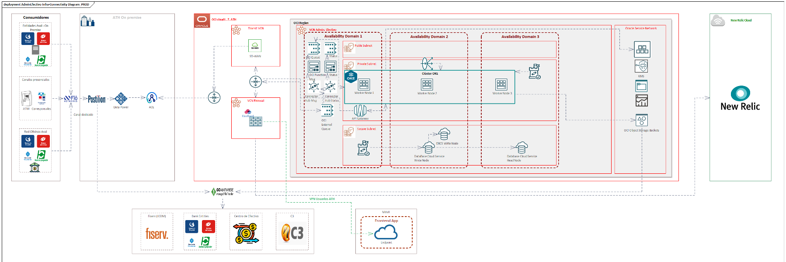

## Architecture 

1. **Consumidores**

- **Entidades Aval - On Premise:** Bancos que acceden al sistema desde sus propias redes.
- **Canales presenciales:** Cajeros automáticos (ATM) y corresponsales que interactúan con el sistema.
- **Red Oficinas Aval:** Oficinas físicas de bancos que también forman parte de los consumidores del sistema.

Todos los consumidores interactúan con el sistema a través de un canal dedicado (red segura).

2. **ATH On-Premise**

- **DataPower:** Gestiona y asegura el tráfico entre los consumidores y los servicios en la nube.
- **ACE:** Actúa como un middleware que enruta las solicitudes hacia OCI.

3. **OCI Cloud (L.Z. ATH)**
   1. **Transit VCN y Firewall**
      2. Transit VCN: Red virtual que conecta los servicios on-premise con la infraestructura en la nube mediante SD-WAN.
      3. VCN Firewall: Garantiza la seguridad de las comunicaciones mediante reglas estrictas.
   2. **VCN Admin. Efectivo**

      La arquitectura de la solución en la nube está distribuida en tres dominios de disponibilidad para garantizar alta disponibilidad y tolerancia a fallos.

        #### Dominios de Disponibilidad
        
        1. **Availability Domain 1, 2 y 3:**
           - **Cluster OKE (Oracle Kubernetes Engine):** Un clúster distribuido de nodos de trabajo donde se despliegan microservicios para procesar las solicitudes. Incluye nodos en dominios múltiples para redundancia.
           - **OCI Queue y OCI Topic:** Servicios de mensajería para gestionar las comunicaciones entre microservicios de manera asíncrona.
        
        #### Base de Datos
        
        - **Autonomous Database:** Almacena los datos estructurados y críticos del sistema.
          - **Oracle NoSQL:** Maneja datos no estructurados o de alta frecuencia.
          - **Stand-By Autonomous Database:** Base de datos de respaldo para garantizar la continuidad del negocio en caso de fallos.
        
        #### Conexiones Seguras
        
        - **Secure Subnet:** Red privada para acceso seguro entre componentes.
        - **Data Pump:** Herramienta para migrar datos entre sistemas.

   3. **Oracle Service Network**
      - **Incluye servicios adicionales como:**
        - **Container Registry:** Almacén de imágenes de contenedores.
        - **OCI Object Storage Buckets:** Almacenamiento de objetos para archivos y datos.
        - **Monitoreo (Logging y Metrics):** Gestión de logs y métricas operacionales.

4. **Integraciones Externas**

- **Go Anywhere:** Se conecta con sistemas externos, como:
    - Servicios de pronostico (ICOM).
    - Entidades bancarias AVAL.
    - **Centro de efectivo:** Operaciones de manejo físico del efectivo.
    - **C3:** Sistema adicional que puede gestionar datos o integraciones.

5. **Aplicación móvil**

- **Frontend App:** Interactúa con el sistema a través de un endpoint en la nube, conectado mediante VPN para usuarios de ATH.

### Flujo General

1. Los consumidores (bancos, ATMs, oficinas) generan solicitudes que se procesan a través de DataPower y ACE.
2. Estas solicitudes son redirigidas a la nube OCI mediante Transit VCN y pasan por el VCN Firewall.
3. En OCI, las solicitudes son gestionadas por microservicios desplegados en el clúster de Kubernetes (OKE), y los datos se almacenan o consultan en las bases de datos de Oracle (Autonomous y NoSQL).
4. Las integraciones externas y la aplicación móvil permiten ampliar las funcionalidades y accesos para otros sistemas y usuarios finales.

### Diagram
