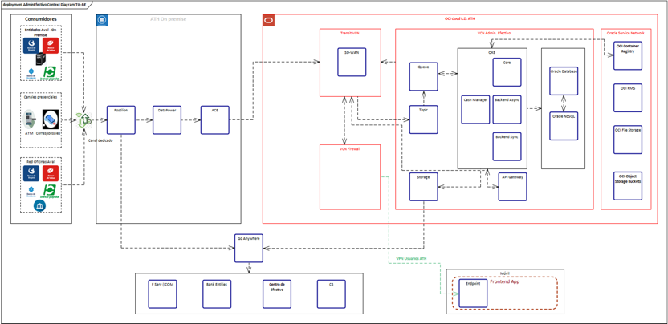

## Context

1. **Consumidores**

- **Entidades Aval - On Premise:** Incluye instituciones bancarias que acceden al sistema, como Banco de Bogotá, Banco de Occidente, y otros de la red Aval.
- **Canales presenciales:** Se refiere a cajeros automáticos (ATM) y corresponsales bancarios que interactúan con el sistema para realizar operaciones.
- **Red Oficinas Aval:** Representa las oficinas físicas de los bancos que acceden al sistema.

Estas interacciones con el sistema se realizan a través de un canal dedicado.

2. **ATH On-Premise**

- **Postilion, DataPower, ACE:** Estos son sistemas o módulos que actúan como intermediarios en el flujo de datos.
- **Postilion:** Procesa transacciones de cajeros automáticos y corresponsales.
- **DataPower:** Un sistema de IBM que gestiona y asegura las comunicaciones.
- **ACE:** Un componente que puede representar un balanceador o middleware que conecta con los servicios en la nube.

3. **Oracle Cloud Infrastructure (OCI)**

- **Transit VCN:** Es una red virtual conectada (Virtual Cloud Network) que permite la comunicación entre los sistemas on-premise y la nube mediante SD-WAN (tecnología de red que optimiza el tráfico).
- **VCN Firewall:** Proporciona seguridad para filtrar y monitorear el tráfico de red.

    ######   i. **VCN Admin. Efectivo**

    En esta parte de la nube se gestionan los componentes principales del sistema:
    - **OKE (Oracle Kubernetes Engine):** Aloja microservicios que incluyen:
        - **Core:** Componente central del sistema.
        - **Cash Manager:** Maneja la gestión y procesamiento de transacciones de efectivo.
        - **Backend Async/Sync:** Microservicios que gestionan la comunicación asíncrona y síncrona.
      - **Queue y Topic:** Representan la mensajería y eventos para gestionar las operaciones entre microservicios.
      - **Storage:** Almacenamiento de datos y archivos.
      - **API Gateway:** Actúa como puerta de entrada para las aplicaciones móviles o externas.
      - **Oracle Database y Oracle NoSQL:** Bases de datos para almacenar la información transaccional y no estructurada.
      - **Servicios adicionales en OCI:** Incluyen registros de contenedores (OCI Container Registry), cifrado de claves (OCI KMS), y almacenamiento de archivos y objetos.

4. **Integraciones Externas**

- **Go Anywhere:** Un sistema que parece actuar como un integrador para comunicarse con:
    - Servicios de pronostico (ICOM).
    - Entidades bancarias AVAL.
    - **Centro de efectivo:** Gestión física del efectivo.
    - **C3:** Sistema de gestión y consolidación de saldos.

5. **Aplicación móvil**

- **Frontend App:** Una aplicación móvil que permite a los usuarios interactuar con el sistema, conectándose a través de VPN para asegurar la comunicación.

### Flujo General

1. Consumidores (bancos, ATMs, oficinas) interactúan con los sistemas on-premise (Postilion, DataPower, ACE).
2. Estos sistemas envían solicitudes a la nube OCI a través de la red Transit VCN y el SD-WAN.
3. Los microservicios en OCI gestionan las operaciones y almacenan la información en bases de datos (Oracle Database/NoSQL).
4. Las integraciones externas y la aplicación móvil se conectan al sistema para ofrecer funcionalidades adicionales.

### Diagram
