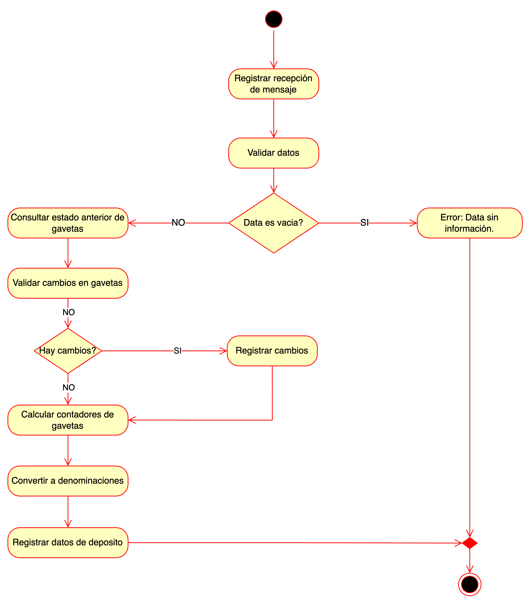

## Deposit Process
### Flow

1. **Inicio del proceso**

   - **Registrar recepción de mensaje:** El sistema registra que ha recibido un mensaje relacionado con una operación de depósito.
   - **Validar datos:** Se valida si los datos contenidos en el mensaje son correctos y completos.

2. **Validación inicial**

   - **¿Los datos están vacíos?**
     - **Si sí, se genera un error con el mensaje:** “Data sin información”, y el proceso termina.
     - Si no, se continúa con el siguiente paso.

3. **Consulta del estado previo**

   - **Consultar estado anterior de gavetas:** El sistema recupera la información registrada previamente sobre las gavetas de efectivo.

4. **Validación de cambios**

   - **Validar cambios en gavetas:** Compara los datos recibidos con el estado previo para determinar si hubo cambios.
   - **¿Hay cambios?**
     - Si sí, el sistema registra los cambios en las gavetas.
     - Si no, se pasa directamente al cálculo de los contadores.

5. **Actualización de contadores y denominaciones**

   - **Calcular contadores de gavetas:** Se determinan las cantidades exactas de efectivo en cada gaveta según la información más reciente.
   - **Convertir a denominaciones:** Se transforman los contadores en unidades de billetes y monedas específicas.

6. **Registro del depósito**

   - **Registrar datos de depósito:** Se almacena la información relacionada con el depósito, incluyendo los contadores actualizados y las denominaciones correspondientes.

7. **Finalización**

   - El proceso concluye después de registrar los datos del depósito y realizar todas las actualizaciones necesarias.

#### Resumen del proceso

**Este flujo asegura que:**
1.	Los datos de depósito sean validados y procesados correctamente.
2.	Los cambios en las gavetas sean registrados de manera precisa.
3.	Los contadores de efectivo y denominaciones se actualicen para reflejar el estado real del efectivo depositado.

### Sequence

#### Componentes del diagrama

1. **Main Flow:** Representa el flujo principal que orquesta el proceso.
2. **Messaging System:** Componente que valida, clasifica y enruta el mensaje recibido.
3. **Log:** Registra eventos importantes, como errores o confirmaciones.
4. **Other Flow:** Refiere a otros flujos alternativos en caso de que el mensaje no sea de depósito.
5. **Deposit Flow:** Maneja el flujo específico para procesar un depósito.
6. **Database:** Almacena y consulta información sobre los estados actuales de los contadores y cambios en las gavetas.

#### Flujo Detallado

1. **Recepción del mensaje**

   - El flujo comienza cuando el Messaging System recibe un mensaje enviado desde el Main Flow.
   - **El Messaging System:**
     - Valida si el mensaje contiene datos.
     - **Si el mensaje está vacío:**
       - Registra un evento en el Log indicando que el mensaje está vacío.
       - Termina el proceso.

2. **Validación del tipo de mensaje**

   - Si el mensaje contiene datos, el Messaging System verifica el tipo de mensaje:
   - Si el mensaje no corresponde a un depósito, se redirige al Other Flow para ser procesado en el flujo adecuado.
   - Si el mensaje es de depósito, se envía al Deposit Flow para ser procesado.

3. Proceso del depósito (Deposit Flow)

    Cuando se valida que el mensaje corresponde a un depósito, se realizan las siguientes tareas dentro del Deposit Flow:
   1.	**Consultar el estado actual de las gavetas:**
      - Se consulta en la Database el estado actual de las gavetas para obtener información previa.
   2.	**Comparar los datos recibidos con el estado actual:**
      - Se compara el mensaje recibido con el estado registrado de las gavetas para detectar cambios.
   3.	**Registrar cambios en el estado:**
      - Si se detectan cambios, estos se registran en la Database y se documentan en el Log.
   4.	**Calcular contadores y convertir a denominaciones:**
      - Se calculan los contadores actualizados de efectivo en las gavetas.
      - Los contadores se convierten a denominaciones específicas (p. ej., billetes y monedas).
   5.	**Actualizar los contadores de depósito:**
      - Los contadores de depósito se actualizan en la Database para reflejar los cambios más recientes.

4. **Confirmación de finalización**

   - Una vez que el flujo de depósito ha sido completado con éxito, el Deposit Flow notifica al Messaging System.
   - El proceso se registra como exitoso y el flujo global termina.

#### Errores y Manejo de Excepciones

Mensaje vacío:
- Se registra un evento en el Log y se termina el proceso.
Mensaje no relacionado con un depósito:
- El mensaje se redirige al flujo correspondiente para ser procesado.
Errores durante el flujo de depósito:
- Los cambios o errores detectados se documentan en el Log, y el flujo maneja la excepción para continuar con la operación.

Resumen del Proceso

- Propósito: Garantizar que los mensajes de depósito se procesen correctamente, validando los datos y actualizando los estados del sistema.
- Resultados esperados:
	1.	Validación adecuada de los mensajes recibidos.
	2.	Sincronización precisa de los cambios en las gavetas.
	3.	Registro confiable de datos en la base de datos y en los logs.
- Robustez: Manejo de errores y redirección de mensajes no válidos a flujos alternativos.

