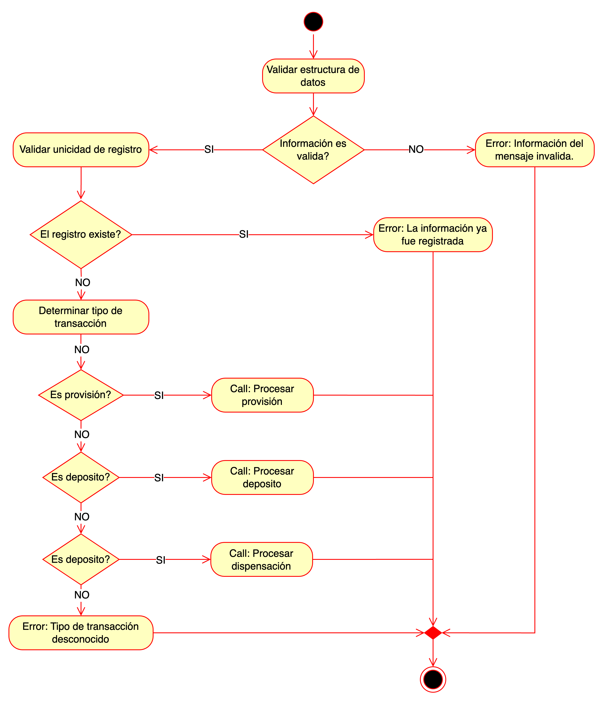
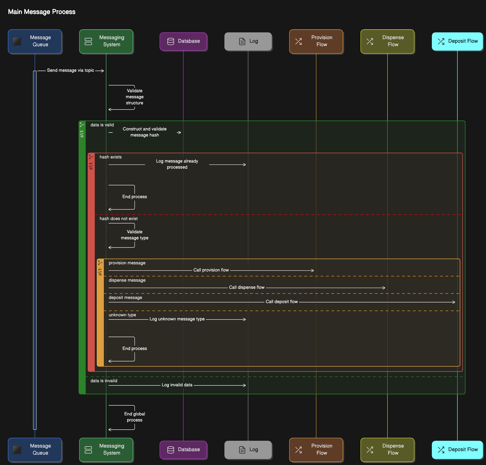

## Main Process

### Flow

1. **Validación de la estructura de datos**

    El proceso inicia verificando que la estructura del mensaje sea correcta:
    - Si la información es inválida, se genera un error con el mensaje: “Información del mensaje inválida”, y el proceso termina.
    - Si la información es válida, se procede al siguiente paso.

2. **Validación de la unicidad del registro**

    Se verifica si la información del mensaje ya existe:
    - Si el registro existe, se genera un error con el mensaje: “La información ya fue registrada”, y el proceso termina.
    - Si el registro no existe, se pasa al siguiente paso.

3. **Determinación del tipo de transacción**

    El sistema identifica el tipo de transacción especificada en el mensaje. Según el tipo, se llama al flujo correspondiente:
    - **¿Es provisión?**
      - Si sí, se llama el flujo para procesar una provisión (Call: Procesar provisión).
      - Si no, se pasa al siguiente paso.
    - **¿Es depósito?**
      - Si sí, se llama el flujo para procesar un depósito (Call: Procesar depósito).
      - Si no, se pasa al siguiente paso.
    - **¿Es dispensación?**
      - Si sí, se llama el flujo para procesar una dispensación (Call: Procesar dispensación).
      - Si no, se genera un error con el mensaje: “Tipo de transacción desconocido”, y el proceso termina.

4. **Fin del proceso**

    Cuando la transacción ha sido procesada satisfactoriamente (o un error ha sido generado), el flujo concluye.

### Sequence

#### Actores Principales

1. **Message Queue:** El sistema que envía los mensajes para ser procesados.
2. **Messaging System:** Responsable de validar y manejar los mensajes.
3. **Database:** Utilizada para verificar y registrar información relacionada con los mensajes.
4. **Log:** Registra eventos clave como errores o confirmaciones de procesamiento.
5. **Provision Flow:** Maneja las transacciones de provisión.
6. **Dispense Flow:** Maneja las transacciones de dispensación.
7. **Deposit Flow:** Maneja las transacciones de depósito.

#### Flujo Detallado

1. **Inicio del Proceso**

   - El Message Queue envía un mensaje al Messaging System a través de un tópico.
   - El Messaging System valida la estructura del mensaje:
   - Si la estructura es inválida, se registra un error en el Log y el proceso termina.
   - Si la estructura es válida, el sistema procede al siguiente paso.

2. **Construcción y Validación del Hash**

   - Se genera un hash único basado en los datos del mensaje. Este hash se utiliza para verificar si el mensaje ya ha sido procesado:
   - Si el hash existe en la Database:
   - Se registra en el Log que el mensaje ya fue procesado.
   - El proceso termina.
   - Si el hash no existe, el sistema procede a validar el tipo de mensaje.

3. **Validación del Tipo de Mensaje**

    El Messaging System analiza el contenido del mensaje para determinar el tipo de transacción:
    - **Provisión:**
      - Si el mensaje corresponde a una provisión, se invoca el flujo de provisión (Call Provision Flow).
    - **Dispensación:**
      - Si el mensaje corresponde a una dispensación, se invoca el flujo de dispensación (Call Dispense Flow).
    - **Depósito:**
      - Si el mensaje corresponde a un depósito, se invoca el flujo de depósito (Call Deposit Flow).
    - **Tipo desconocido:**
      - Si el tipo no se reconoce, se registra un error en el Log indicando un tipo de mensaje desconocido y el proceso termina.

4. **Manejo de Datos Inválidos**

   - Si los datos del mensaje son inválidos en algún punto del flujo, se registra en el Log como datos inválidos y el proceso global termina.

#### Interacciones Clave

- Message Queue ↔ Messaging System: El sistema recibe los mensajes desde la cola para iniciar su procesamiento.
- Messaging System ↔ Database: Verifica la unicidad del mensaje utilizando el hash y almacena información relevante sobre el procesamiento.
- Messaging System ↔ Log: Registra eventos importantes como errores, datos inválidos, y confirmaciones de procesamiento.
- Messaging System ↔ Flujos Específicos: Invoca los flujos correspondientes según el tipo de transacción (provisión, dispensación o depósito).

#### Errores y Finalización del Proceso

- **Errores de validación:** Si la estructura o los datos del mensaje no son válidos, el proceso termina registrando el error.
- **Mensajes duplicados:** Si el hash ya existe, el sistema evita reprocesar el mensaje y finaliza.
- **Procesamiento exitoso:** Si el mensaje es válido y su tipo es reconocido, se ejecuta el flujo correspondiente.

#### Propósito del Proceso

Este diagrama muestra un flujo eficiente y robusto para manejar mensajes en un sistema distribuido, garantizando:
- Validación y unicidad de los mensajes.
- Manejo de errores y registro detallado.
- Ejecución específica según el tipo de transacción.

