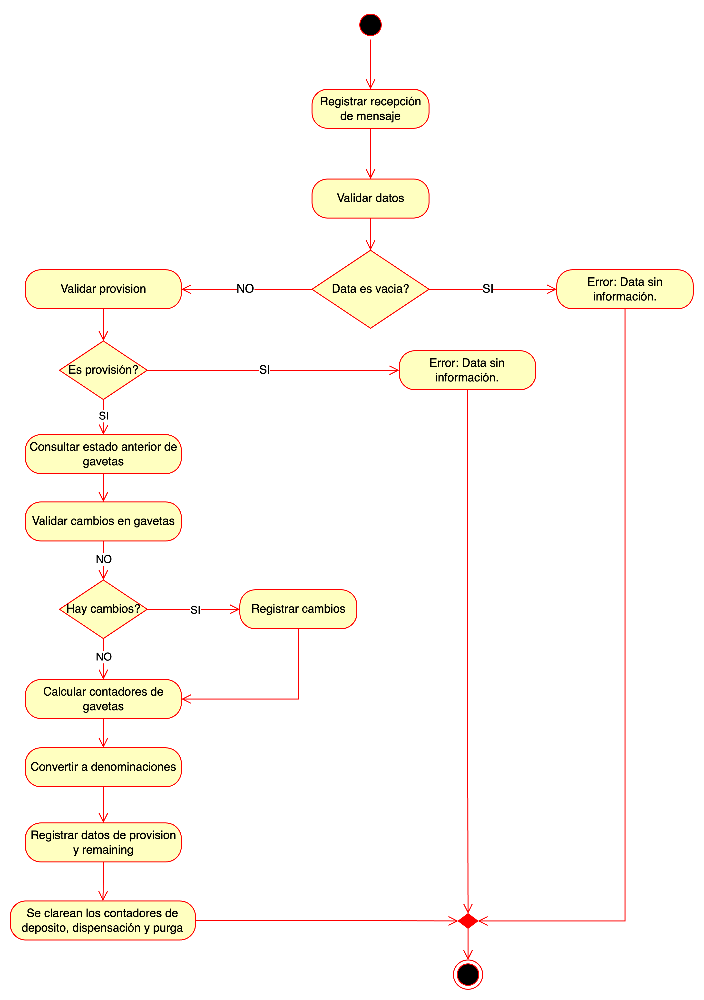
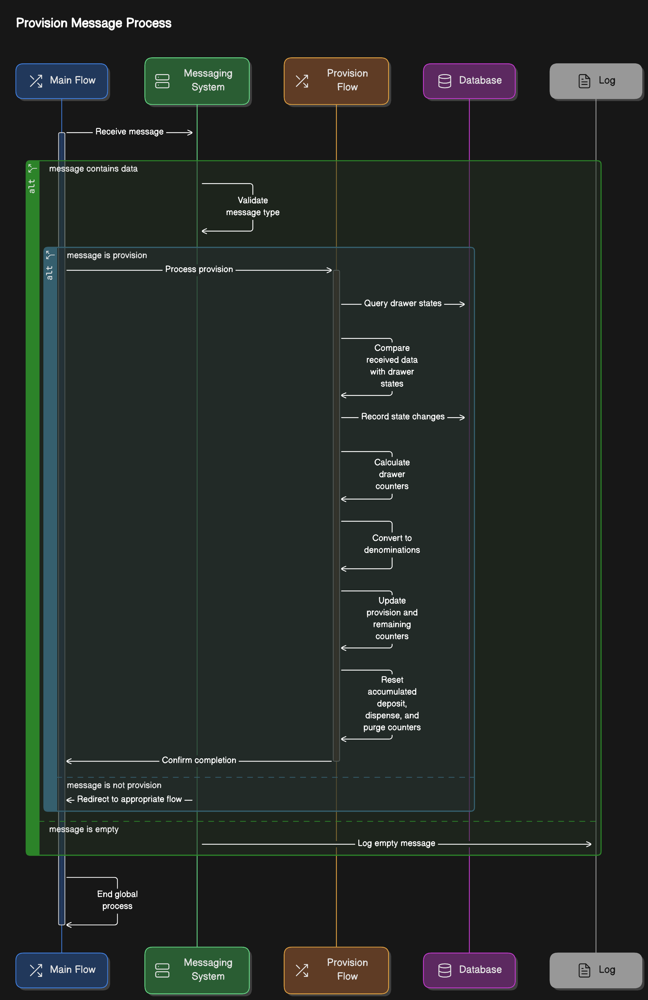

## Provision Process

### Flow

1. **Recepción del mensaje**

    El proceso comienza con la recepción del mensaje que contiene los datos de la provisión. Esta etapa incluye:
    - Registro de la recepción del mensaje: El sistema documenta que ha recibido el mensaje.
    - Validación de los datos: Verifica si los datos incluidos en el mensaje son correctos.

2. **Validación inicial de los datos**
   - ¿Los datos están vacíos?
   - Si sí, se genera un error: “Data sin información”, y el proceso termina.
   - Si no, se procede a validar si el mensaje corresponde a una provisión.

3. **Validación de la provisión**

   - ¿Es una transacción de provisión?
   - Si no, el proceso redirige a otro flujo según el tipo de transacción.
   - Si sí, se consulta el estado anterior de las gavetas para comparar los datos.

4. **Validación de cambios en las gavetas**

   - Consulta del estado anterior de gavetas: El sistema revisa los registros previos para identificar cualquier cambio.
   - ¿Hay cambios en las gavetas?
   - Si sí, se registran los cambios en el sistema.
   - Si no, se pasa al cálculo de los contadores.

5. **Cálculo de contadores**

    Si no hay cambios previos en las gavetas, el sistema realiza los siguientes pasos:
    - Calcular contadores de las gavetas: Determina las cantidades exactas de efectivo contenidas en cada gaveta.
    - Convertir a denominaciones: Transforma los contadores en unidades de monedas o billetes específicos.
    - Registrar datos de provisión y remaining: Almacena los datos relacionados con la provisión y el saldo restante de efectivo.

6. **Limpieza de contadores**

   - Se limpian los contadores relacionados con depósitos, dispensaciones y purgas para garantizar que los valores estén actualizados y listos para nuevas operaciones.

7. **Finalización**

    El proceso concluye con la ejecución de todos los pasos necesarios, y el sistema queda preparado para manejar el próximo mensaje.

### Resumen del propósito del flujo

Este flujo asegura que:
1.	Los datos de provisión sean validados correctamente.
2.	Los cambios en las gavetas sean registrados.
3.	Los contadores y denominaciones sean actualizados para reflejar el estado real del efectivo del cajero.
4.	Se manejen los errores de manera estructurada.

### Sequence

#### Actores y Componentes

1. **Main Flow:** El flujo principal donde se inicia el proceso.
2. **Messaging System:** Sistema que valida y procesa mensajes recibidos.
3. **Provision Flow:** Componente encargado de gestionar el flujo específico de provisión.
4. **Database:** Almacena y consulta el estado actual de los contadores y datos de las gavetas.
5. **Log:** Registra eventos importantes, como errores o confirmaciones del proceso.

#### Flujo Detallado

1. **Recepción del mensaje**

   - El Main Flow recibe un mensaje enviado al sistema.
   - El Messaging System:
   - Valida si el mensaje contiene datos:
   - Si los datos están vacíos, registra el evento en el Log y termina el proceso.
   - Si los datos existen, procede a validar el tipo de mensaje.

2. **Validación del tipo de mensaje**

   - El Messaging System verifica si el mensaje corresponde a una provisión:
   - Si sí, redirige al Provision Flow.
   - Si no, redirige a un flujo apropiado (p. ej., flujo de depósito o dispensación).

3. **Proceso de provisión**

    Si el mensaje corresponde a una provisión, el Provision Flow realiza las siguientes tareas:
   1.	**Consulta del estado actual de las gavetas:**
      - Se recupera la información del estado previo de las gavetas desde la Database.
   2.	**Comparación de datos recibidos:**
      - Se comparan los datos recibidos con el estado actual de las gavetas.
   3.	**Registro de cambios:**
      - Si se detectan cambios en el estado de las gavetas, se registran en la Database.
   4.	**Cálculo de contadores:**
      - Se recalculan los contadores de las gavetas según los nuevos datos.
   5.	**Conversión a denominaciones:**
      - Los contadores se convierten en denominaciones específicas (p. ej., billetes y monedas).
   6.	**Actualización de contadores de provisión y restantes:**
      - Se actualizan los valores de provisión y los saldos restantes en la Database.
   7.	**Reinicio de contadores acumulados:**
      - Se limpian los contadores acumulados de depósito, dispensación y purga para evitar inconsistencias.

4. **Confirmación de finalización**

   - Una vez completado el flujo de provisión, se envía una confirmación al Messaging System indicando que el proceso fue exitoso.

#### Errores y Manejo de Excepciones

- Si el mensaje no contiene datos o es inválido, el sistema registra el error en el Log y termina el proceso.
- Si el tipo de mensaje no corresponde a provisión, se redirige al flujo correspondiente.

#### Resumen del Flujo

**Este proceso asegura:**
1.	La validación y clasificación adecuada de los mensajes recibidos.
2.	La sincronización precisa entre el estado previo y los cambios en las gavetas.
3.	La correcta actualización de contadores de efectivo, garantizando que los datos sean consistentes y reflejen la realidad operativa.

